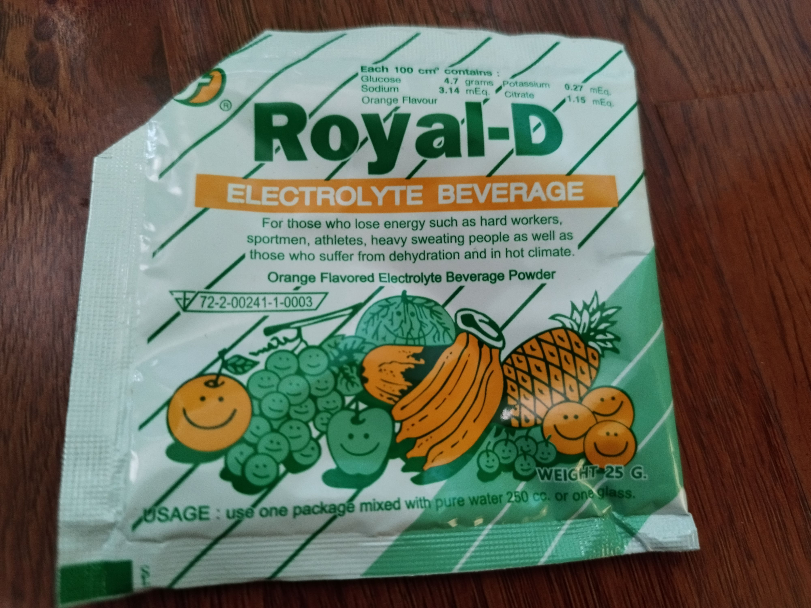
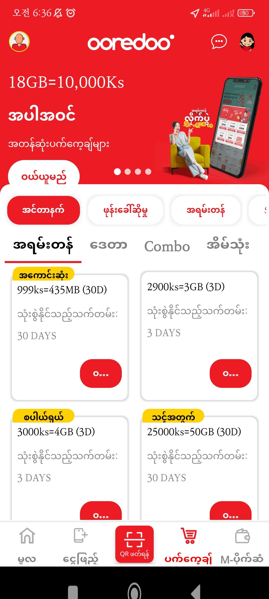

<h2 style="margin-top: 0;">📑 목차</h2>

- [들어가며](#들어가며)
- [최신 내용 혹은 편집 중](#최신-내용-혹은-편집-중)
- [공양간에서](#공양간에서)
- [승원에서](#승원에서)
- [꾸띠에서](#꾸띠에서)
- [법당에서](#법당에서)
- [기타](#기타)

## 들어가며
- 위니야 질문과 대답들을 모은 문서입니다.
- 대부분의 내용들은 다음 형식으로 되어 있습니다.
- 질문
- 대답 / 출처
- (있을 경우)배경
- (있을 경우)추가질문
- 출처 태그는 다음으로 구성되어 있습니다.
- 우꾸마라 : 우꾸마라 아비왐사
- 담마다야다 : 담마다야다 반떼
- 찬다 수마나: 스리랑카 율사 반떼
- 미얀마 빅쿠: 일반 미얀마 빅쿠 의견
- 스리랑카 빅쿠: 일반 스리랑카 빅쿠 의견
- 당사자가 아닌 이상 배경을 봐도 의심의 원인을 온전히 이해하기는 힘듭니다. 해당 내용에 대해 궁금한 점이나 의심가는 점이 있다면 다시 자격있는 스승들에게 물어보기 바랍니다.
- 공식적인 자료가 아니니 적극 배포는 하지 말아 주시기 바랍니다.
-
## 최신 내용 혹은 편집 중
	- 발우를 들고 가다가 음식을 흘렸다면 다시 주워 먹을 수 있는가?
		- 주워서 먹을 수는 없다. 먹으려면 깝삐야나 사마네라에게 다시 받아야 한다. 왜냐면 먼지가 묻었고 먼지가 주어지지 않은 음식이기 때문이다. #우꾸마라
		- 추가질문: 공양을 하다가 음식을 입으로 한 입 베어 먹은 다음 넣었다면 먹을 수 있는가?
			- 먹을 수 없다. 침이 묻었기 때문. 먹으려면 그 부분을 덜어 낸 다음 먹을 수 있다. #우꾸마라
		- 먹던 음식을 발우 아닌 발우 뚜껑에 놓았다면 다시 먹을 수 있는가?
			- 없다. 다시 보시 받아야 한다. 발우 뚜껑에 먹던 음식을 놓고 계속 먹으려면 발우 뚜껑을 손에서 떼면 안된다. 미얀마의 어떤 사야도는 이 계율 때문에 빅쿠들이 수시로 범계한다고 하기도 한다. #우꾸마라
## 공양간에서
	- 이 컵은 허용되는가?
		- 
			- 많은 사람들이 사용하고 있다. 허용된다. 하지만 의심이 있다면 승원 재산으로 여길 것. #우꾸마라
	- 어제 라면을 승원 북샵에서 마련했다. 즉 깝삐야로부터 받았다. 그것을 공양간 앞에 두었다. 그 뒤 다음날 깝삐야에게 가르켜 그 라면을 받았다. 이럴 경우 받은 빅쿠는 범계인가?
		- 어제 빅쿠가 받은 라면을 보관했다가 오늘 다시 받았다면 보관한 음식을 받은 것이니 범계입니다. 그 라면을 다른 빅쿠가 먹어도 범계입니다. #담마다야다
	- 오늘 받은 음식을 깝삐야에게 주면서 내일 달라고 했다. 이 경우 범계인가?
		- 이 경우 빅쿠가 라면을 받아서 욕망을 완전히 포기하고 깝삐야게게 주고 깝삐야가 다음날 보시한다면 가능합니다. 빅쿠의 진정한 의도가 애매할 수도 있습니다. 깝삐야에게 주면서 내일 달라고 하면서 주고 깝삐야가 내일 그것을 주는 경우 소유권, 욕망을 완전히 포기하지 않았으므로 범계입니다.#담마다야다
	- 발우를 물을 안 닦고 말리면 범계
	- 녹차를 다음날 음식과 섞어 먹는다면?
		- #우꾸마라 좋지 않다. 좋지 않다는 말은 많은 나라에서는 녹차를 약으로 보지만 미얀마에서는 많은 빅쿠들이 음식으로 본다. 우리는 차 잎을 쌀과 같이 먹곤 한다. 그래서 우리는 그것을 야와깔리까(음식)으로 본다. 이것이 첫번째 이유 스리랑카 같은 나라에서는 차를 음식으로 보지 않기에 그래서 약으로 본다. 
		  두번째 이유. 이미 차를 마셨다고 하면 너의 침이 거기에 묻었다고 하자. 그리고 차에서 손을 뗐다. 그럼 그것도 (바로 먹는 것이) 허용안된다. 깝삐야나 사마네라에게 다시 보시해달라고 요청해야 한다. 왜냐면 침이 이미 너의 몸을 떠났다면 그것은 '보시받지 않은 음식'이기 때문이다.
		  차를 (끓여서를 의미하는 듯) 가지고 한 밤 이상 가지고 있는 것은 적절치 않다. 승원에는 차가 많이 있다. 다시 보시 받아 먹으면 아무런 의심도 없을 것이다.
		  배경: sattāhakālika and yāvajīvika question, In our sankika table there is green tea leap. That is yāvajīvika. Maybe another bhikkhu receive and put this previous day. If I take that green tea , Can I shake ekāsanabhojanaṃ with that green tea?
	- 공양간에 놓인 평생 약인 차와 그날 받은 음식을 섞어 먹는 문제
		- 사실 이 문제 요지는 어제 다른 빅쿠가 받은 평생 약을 내가 오늘 취했을 때 오늘 받은 음식과 섞어 먹을 수 있는가였는데요. 가능한가요?
			- 섞어 먹을 수 없습니다. #담마다야다
	- 발우 햇볕 없는데서 오래 말려도 될까?
		- 냄새가 좀 빠질 때까지 발우를 햇볕에 말릴 수 있다. 햇빛없어도 잠깐 말릴 수 있다. 비가 와도 약간의 햇빛이 있다.#우꾸마라
		- 추가질문: 그럼 오래 말려도 된다는 소린가?
			- (햇빛이 없다면) 너무 오래는 안되고 너무 길지도 너무 짧지도 않게 말려야 한다.
	- 공양간에 발우 놓고 다니는 빅쿠들 있는데 범계인가?
		- 아니다. 하지만 어떤 사야도들은 개인 발우는 여기 놓지 말라고 말씀하기도 한다. 사실 빠따말라까(?) 라고 해서 빅쿠들 발우들을 먹고 나서 정렬해두는 장소 개념도 있다. 사마네라 스쿨에 있음 #찬다수마나
	- 로얄디는 강장제인가 주스인가?
		- 
		- 7일 강장제다. 오렌지맛이라고 있지만 그것은 그냥 (오렌지가 인 섞인 화학 제품) 물에 섞어도 7일  #찬다수마나
		- 배경: 성분 glucose 포도당 sodium 나트륨 potasium citrate 시트르산염 Orange flavour 오렌지향 오렌지맛
	- 에너지 드링크는 주스인가 7일 약인가?
		- 당연히 주스이다. #우꾸마라
		- 
	- 공양간 식기나 그릇을 깝삐야에게 허락맡고 사용가능한가? 약을 끓일 용도로.
		- 가능하다. #찬다수마나
	- 마 가루(Yam powder)가 약으로 허용되는가?
		- #찬다수마나 허용된다.
		- #담마다야다 마는 식용이냐, 약용이냐가 쟁점인데 한약재로 주로 사용되니 약으로 볼 수 있는데, 중국 빅쿠들은 어떻게 보고 있는지 먼저 알아보기 바랍니다. 약으로 본다면 오후에 먹을 수 있습니다.
	- 타미린드 플레이크(말린 조각)가 나왔다. 식용인가 7일 혹은 평생 약인가?
		- 
		- 의견 1. 2와사 의사 반떼. 내가 알기론 평생 약이다. 하지만 음식으로 취하면 음식. #미얀마빅쿠
		- 의견 2. 2와사 스리랑카 반떼. 정오 전 음식이다. #스리랑카빅쿠
		- 추가질문: 저거보면서 겉에 파인애플 향이라고 적힌 걸 미얀마 빅쿠가 파인애플로 봐서 일단 음식으로 결론 내렸는데요. ~향이 첨가된 경우 그걸 음식으로 보나요?
		- 향이 첨가되었다는 말의 정의를 내려면 제조 과정을 알아봐야 정확히 알 수 있을 것입니다. 파인애플 향을 내려고 과육을 섞었는가의 여부 등. 단순히 파인애플 냄새에 노출된다고 향이 배이지는 않을 것입니다. 타미린드 등은 그 식물이 자생하는 국가가 약으로 보는지 음식으로 보는지에 달렸습니다 #담마다야다
	- 공양간 상기까 테이블에 마스크 재가자도 쓰고 빅쿠들도 쓰는데 이것 허용되는가?
		- 나눠 놓는 것이 좋겠고 사용하려면 깝삐야에게 요청하는 것이 좋다. #우꾸마라
	- 음식 피드백을 요청하는 재가자에게 대답해도 되는걸까?
		- 청정한 마음으로 기대없이 의도없이 이야기 한다면 문제없음. #우꾸마라
			- 배경: 어느 재가자가 우릴 위해 김치를 만들었다며 음식평을 물어봄. Some upasaka told me that I arranged food for korean for 3days. And I will make that food again. So tell me the feedback of the food. In this case, can we say real feedback? Like salty or not salty enough?
	- 레몬 기름을 보시받았다. 식용으로 허용되는가?
		- 누군가는 레몬을 야와지와까 평생약으로 보지만 누구는 다른 의견. 주스 혹은 야와까리까 1일 사용으로 봄. #우꾸마라
		- 배경: According to commentary if one keep plant oil which is not included in vibhanga, dukkatta. is lemon oil allowable?
		  		  무엇을 위해서? (먹는 거라던가) 누군가는 레몬을 야와지와까 평생약으로 보지만 누구는 다른 의견. 주스 혹은 야와까리까 1일 사용으로 봄.
		  		  @그래서 레몬 오일은 허용되나 >> 잎이나 나무서 만들어진 거면 됨.  과일에선 안됨. 누군가는 평생약으로 보고 누구는 주스로 본다.
	- 발우에 쓰레기를 넣어서는 안된다. 발우 뚜껑에 올려야 한다.  (매번 과자봉지랑 요쿠르트 쓰레기를 발우에 넣어서 한번에 버렸는데 발우에 쓰레기를 넣어서는 안된다고 함.) #미얀마빅쿠
		- 추가질문: 그런데 다 먹은 과자봉지가 아니고 새 과자봉지도 발우에 넣으면 안되나요? 아니면 관계없나요?
			- 음식이 들어있으면 넣을 수 있음. #담마다야다
	- 내 필수품으로 음식 준비해달라고 하면 문제가 되는가?
		- 자기 필수품으로 하는 건 문제없음 #담마다야다
		- 배경: If some bhikkhu ask to laypeople. "Please arrange food in that restaurant to use my allowble requisite. Is it allowed? Not almsround, he want to eat in some restaurant. He want to reserve his food in specific restaurant.
	- 오늘 받은 공양에다가 다른 날 받은 아바민 알약을 섞어 먹었다면 범계인가?
		- 범계. 같은 날에 받지 않은 약과 음식은 섞어 먹을 수 없다. #찬다수마나
	- 다른 날에 받은 약과 7일 보관 강장제를 섞어 먹을 수 있는가?
		- 있다. #찬다수마나
		- 배경: 같은 날에 받지 않은 약과 음식은 섞어 먹을 수 없다. 그러나 다른 날에 받은 약과 7일 보관 강장제 등은 같은 날이 아니라도 섞어 먹을 수 있다. 섞을 경우 더 적은 사용기한을 기준으로 한다. 다른 날 받은 강장제들도 섞어 먹을 수 있다.
	- 오후에 받은 주스를 데워 먹어도 되나요?
		- 안된다. 오직 해가 뜨겁게 하는 정도만 이용가능. (이미 요리된 것만)정오 전에 빅쿠는 음식을 데워 먹을 수 있다.  오후가 되면 빅쿠는 데워 먹을 수 없다. 주스도 안된다. #찬다수마나
		- 오후에 쥬스를 데워 먹을 수 없습니다. 햇볕에 데워 먹는 것은 가능합니다. 오전에도 불로 요리된 것만 데울 수 있습니다. 오전에 쥬스 데우는 것도 안 되겠지요. #담마다야다
		- 반떼 그러면 오후에 차나 커피도 쿠커에 못 데우는 건가요?
		- 평생 보관약에 들어가는 약이나 차는 끓일 수 있습니다. #담마다야다
	- 강장제나 약을 오후에 씹어 먹어도 됩니까?
		- 씹어도 되지만 음식과 관련된 것을 씹는 것은 적절치 않다. 예를 들어 레몬같은 것은 약이지만 그렇다고 씹어 먹는 것은 적절치 않음. #찬다수마나
		- 강장제나 약은 오후에 씹어 먹을 수 있습니다. 단, 오후에 건더기 없는 과일즙은 허용되나 건더기가 있으면 안됩니다. #담마다야다
	- 탁발 때 보시자 얼굴 보지 말아야하는데 이야기를 해도 되는가.  축원을 해도 되는가?
		- 문제없다. 하지만 먹는 도중에 이야기한다면 적절치 않다. 그건 빅쿠끼리도. #찬다수마나
		- 탁발 시 무슨 고기인지 묻는 것 외 할 말이 거의 없음. 축원은 식사 후 함. 입에 음식을 넣은 채 말하면 안 됨. #담마다야다
	- 보시음식 개한테 줘도 되는가?
		- 줘도 문제없다. 하지만 승원에 따라 주면 안된다고 공지하기도 함. 이건 계율이라기보다 승원 운영에 문제가 될 수도 있는 것. 자꾸 주면 자꾸 낳아서 승원 유지에 어려움을 줄 수 있으므로. #찬다수마나
		- 승원에서 개에게 음식 주는 것은 적절허지 않음. 승원에서는 먹을 말큼만 받아오는데 개에게 줄 것이 없음. 산에 살며 탁발한다면 남는 음식을 동물에게 줄 수 밬에 없는 상황. #담마다야다
		- 추가질문: 붓다께서 동물을 기르지 말라고 금지하셨다고 들었는데?
			- 그런 내용은 없다. 다만 승원에 피해주는 동물에 대해 막으신 적은 있다. 붓다 또한 매우 친절하신 분이다.  음식을 준다는 것을 금지하는 계율은 없다. #찬다수마나
	- 이동하면서 음료 등을 먹으면 범계인가?
		- 범계는 아니지만 빅쿠 매너라 볼 수 있다. 재가자들이 볼 때 그러면 적절치 않다. #찬다수마나
	- 보시자 음식을 낭비하면 둑까따라는데 승원 안에서 음식을 버린다면 범계인가?
		- 승원 안에서는 문제없다. 하지만 마을에서 음식을 던지면 아빳띠다. #찬다수마나
		- 배경: I heard that If we waste alms food then dukkata, is it right?
		  		  승원 안에서는 문제없다. 하지만 마을에서 음식을 던지면 아빳띠다. 작은 물에 던져도 나무에 던져도 안됨. 물에 매운 걸 던지면 작은 생명체 죽을 수 있고 나무도 죽을 수 있으므로. 사람들이 음식 버리는 곳이면 그곳에 버려야.
		  	  If some bhikkhu receive too much food. He know he can not eat all. And he left alms food. Then is it appatti?
		  		  범계가 아니다. 하지만 그런 사람은 보지니마땃뉴따가 필요하다. 붓다는 그것을 가지고 계시고(음식의 적정양을 아는 능력을 뜻하는 듯) 높은 수준의 증득을 한 사람들도 갖고 있다.
		  		  하지만 아파서 못 먹을 수도 있고 여기 보시자들을 고려해서 받을 수도 있으므로 범계는 아니다.
		  			  음식 남았다면 다른 생명체에게 보시하려는 의도로 버리라는 붓다의 말씀. 마을에서는 세키야 56번 참조.
		  			  받을 때 먹을 만큼만 받는 것이 중요.
	- 꿀이 빤수꿀라에 놓여 있을 때 취할 수 있는가?
		- 빅쿠가 꿀을 (빤수꿀라) 테이블이나 빅쿠 공공장소에 두는 것 자체가 적절치 않다. 깝삐야가 그 꿀을 받아서 그 테이블에 놓을 수도 있다. 하지만 그걸 취하려면 남은 날을 알아야 한다. 남은 날을 모르면 취하지 말아야 한다. 깝삐야에게 포기한다고 날짜가 재계산되지 않는다. #찬다수마나
		- 추가질문: 꿀은 재가자에게 포기해도 날짜 재계산이 안된다고 들었는데 위나야 453을 보면 마음에서 모든 소유권을 버리고 출가자 아닌 사람에게 주었다면 다시 받아 또 다른 7일 사용할 수 있다고 나와 있습니다.
			- 그 위의 3) 번을 보기 바랍니다. 이 점은 논쟁점입니다. 알아본 바에 따르면 다시 사용 가능하다는 빅쿠도 있고 바람직하지 않다는 빅쿠도 있습니다. 날짜를 다시 계산하는 것은 그리 썩 좋은 방법이 아니라는 생각이 듭니다. 그래서 받을 때 7일 정동 분량안 받는 것이 좋습니다 #담마다야다
	- 꿀을 닛사기야 빠찟띠야에 나오는 절차에 따라 포기하지 않고 그냥 화장실에 버렸다면 어떻게 되는가?
		- 불자들은 신심을 가지고 그것을 보시했을 것이다. 그것을 버리는 것은 적절치 않으며 다른 범계. 삿따데위니빠다(신심으로 보시한 것을 버리거나 했을 때 계율인듯)에 저촉될 수 있다. 아주 조금 남았다면 그것을 동물에게 주거나 하는 것은 문제가 되지 않는다. #찬다수마나
		- 추가질문: 그런데 이미 화장실에 버렸다.
			- 그럼 아빳띠데사나만 하면 된다. #찬다수마나
	- 깝삐야 밥 먹는데 눈치줘서 주스 받아도 될까?
		- 문제없다. #찬다수마나
		- 배경: Can we get a juice from devotee who is eating food? When I went to dining room, lay woman ate something. She saw me  and quickly stopped eating then give me juice. 
		  		 문제없다.
	- 보시자에게 받자마자 보시물 다른 재가 불자에게 주기
		- 범계는 아니지만 적절치 않다. 주는 사람의 신심을 떨어 뜨리는 것이다. 그들은 나중에 저 빅쿠들은 어차피 필요없을 것이라며 보시를 더 하지도 않을 것이다. #찬다수마나
		- 보시받자 마자 다른 재가불자에게 보시물을 바로 보시하는 일은 적절하지 않습니다. 나중에 일을 부탁하고 그 댓가로 주는 것을 가능합니다. #담마다야다
			- 추가질문: 워커들에게는 줘도 되는가?
				- 먹을 것은 줄 수도 있다. 하지만 다른 것들을 재가자에게 막 주는 것은 적절치 않다. 여기 주재 깝삐야에게 주는 것은 문제없다. 만약 물건이 쌓이면 상가 오피스에 보시하는 것이 좋다. #찬다수마나
	- 컵 수거통에 보시물 넣기
		- 문제는 없지만 다른 보시자가 있을 때 그렇게 넣는다면 신심을 고려해서 적절치 않음. (난 대면없이 저렇게 놓는 것으로 보시가 가능한가 물은 건데 반떼는 신심문제로 이해하신듯) #찬다수마나
		- 배경:  In old meditation hall, there is a box for putting cups. dining hall kappiya maybe take that and reback. Can I put some item for dana to dining hall kappiya? I mean can I dana to kappiya without meeting?
	- 마하야나 빅쿠는 공양간 상기까(빅쿠들이 음식 공유하는 곳을 의미하는 듯)에서 음식을 가져가서도 안되고 둬서도 안된다. 그가 음식 둔 것을 어느 빅쿠가 먹으면 아빳띠다. 마하야나는 사마네라 먹을 것 두는 곳에 있는 것은 먹을 수 있고 본인이 원하면 음식을 둘 수 있다. #미얀마빅쿠
		- 배경: 마하야나 빅쿠가 마스크를 상기까 테이블에서 가져가는 걸 봤는지 미얀마 빅쿠가 저 말하며 주의 주라고 당부했음.  (부를 때는 반떼라고 부르지만 우빠삼빠다를 안받은 사람으로 취급하는 듯)
	- 사미가 상기까 테이블에 둔 음식을 먹으면 범계인가?
		- 범계임. 모르고 먹어도 아빳띠이긴 하지만 나중에 알았을 때 참회하면 된다. (이렇게 모르고도 하는 범계가 있어 틈만 나면 참회를 하는 듯) #찬다수마나
		- 배경: Bhante, if mahayana bhikkhu or sami put a food to our sangika table, and bhikkhu eat that food, it appatti?
	- 계란을 먹어도 되는 것일까?
		- (자기가 보기에 허용되는 듯 하나)만약 의심이 있다면 안 먹는 좋을 듯 #찬다수마나
		- 고기나 계란 자체가 여법하게 마련된 것이라면 받아 먹을 수 있으나 의심이 간다면 먹지 않는 것이 좋겠지요. #담마다야다
		- 추가질문: 의심있는데 계란을 받아서 빤스꿀라 테이블에 올려 놓고 그걸 다른 빅쿠가 먹어도 되나?
			- 된다. #찬다수마나
		- 추가질문: 만약 의심 있는데 (먹지 않아도) 받는 것은 되나요? 공양가다보면 셰얄레이 쳐다보지 않은 이상 뭔 음식인지 알기 어렵습니다. 거절도 하기 전에 이미 계란을 올려 놓습니다. 만약 안된다면 그 셰얄레이에게 돌려줘야 하나요?
			- 의심이 가고 먹지 않을 것이라면 받지 않는 것이 좋습니다. 거절하기도 전에 모르는 사이에 이미 발우에 놓았다면 자신이 먹지 않는 음식을 놓는 테이블에 두면 됩니다. 고기나 계란 자체가 여법하게 마련된 것이라면 받아 먹을 수 있으나 의심이 간다면 먹지 않는 것이 좋겠지요. 보시자는 쳐다보지 않아야 하지만 보시되는 음식에 항상 눈을 두고 주의를 기울여야 합니다. #담마다야다
	- 스테인리스 여분 그릇 허용되나?
		- 허용된다. #찬다수마나
## 승원에서
	- 허리띠를 안 매면 범계
	- 빅쿠가 아프다면 꾸띠 두 개를 사용할 수 있는가?
		- 책임이 있는 빅쿠(상가 오피스)에게 허락맡았고 그 꾸띠를 관리, 청소한다는 의도가 있다면 가능. #우꾸마라
	- 승원에서 선배가 슬리퍼 벗었을 때
		- 만약에 맨발로 선배가 걷고 있는데 거기를 가려고 한다면 벗어야 한다. 신었으면 신어야 한다. 벗으려면 허락 맡는게 좋음. #우꾸마라
		- 추가질문: 승원에서도 그런가?
			- 특히 walking area에서(경행로란 말인지 확실치 않음) 그래야 한다. 만약 사야도지가 워킹 에어리어에서 맨발로 걷고 계신데 따라가려면 우리도 벗어야.
	- 마낫따하면 네 명의 정상 빅쿠가 필요하다는데...
		- 그렇다. @나는 상주 빅쿠 하나 밖에 못 봤는데. >> 거기 언제나 상주하는 빅쿠가 둘이 있고 보통 마나따를 하면 빅쿠 둘 셋을 (섭외해서) 데려 온다. 그래서 적어도 다섯 빅쿠는 있다.(꼭 셋이 동시에 그 쪽으로 가는 걸 자주 봤는데 이게 마낫따 하면 섭외를 해와서 그렇게 가는 듯) #우꾸마라
		- 마낫따 하면 정상 빅쿠 넷에게 알려야 하는 것은 맞지만 그 승원에 정상 빅쿠가 꼭 넷이 없어도 된다. 예를 들어 빠리와사 빅쿠가 넷 마나따 빅쿠 하나 정상 빅쿠 하나가 있으면 빠리와사 빅쿠들이 여명에 의무 제쳐둬서 정상 신분이 되면 그 사람에게 마나따 빅쿠가 알리면 된다. #미얀마빅쿠
	- 마낫따 하면 승원 모든 빅쿠에게 알려야 한다는데 난 들어본 적이 없다.
		- 가본 적이 있는지 모르지만 빠리와사 승원이 따로 있다. 여기서 전 승원 빅쿠에게 알리긴 어려우므로 거기 승원서 지내면서 거기 빅쿠들에게 알린다. (사야도지 꾸띠에서 조금 내려가면 꾸띠 몇개 있는 곳이 있으며 빠리와사 하는 빅쿠는 거기서 머묾. 몰랐는데 거기가 승원이라고 함) #우꾸마라
	- 세나니승원에서 온 셰얄레이가 자기가 한의사 전문의였다는데 제가 병자를 위해서 승원 어디서 만나자고 해도 되나요?
		- 동행자가 있으면 됩니다. 그리고 이동할 경우, 따로 가면 됩니다. #담마다야다
	- 셰얄레이가 준비한 택시 타고 간다면 범계인가?
		- 만약 셰얄레이가 택시를 준비하고 "반떼, 이 택시를 타면 병원으로 갈 겁니다." 라고 말해서 동의하고 타면 빠찟띠야인가? 그녀는 타지 않았다.
		- 아빳띠 아님. 같이 타고 가야 아빳띠. #찬다수마나
	- 만약 승원 안에서 셰얄레이가 반떼 스탠딩 붓다로 갑시다라고 제안하고 동의하고 내가 같이 갔다면 아빳띠인가?
		- 마을부터 다음 마을까지 가야 아빳띠. 승원 안에서는 아빳띠가 아니다. #찬다수마나
	- 전화로 아빳띠데사나(참회)가 가능할까?
		- 조건부 가능. 한 마을이나 한 도시 내에 빅쿠들이 있다면 가능. 다른 마을 다른 도시는 불가능. 하지만 유효한 지는 확실히 이야기할 수는 없다. #우꾸마라
		- 한 마을이라도 한 빅쿠는 그냥 마을 시마(가마 시마) 에 있고 한 빅쿠는 깜마로 지정된 영역 시마에 있다면 이 아빳띠데사나는 유효하지 않다. #미얀마빅쿠
	- 반떼. 아파서 치과 갈 때도 계사의 허락을 받아야 합니까?
		- 계사의 허락을 받지 않고 마을에 들어가서는 안된다는 대목을 보고 여쭙니다. 종무소 빅쿠들에게는 허락 받았습니다.
			- 승원 경계 밖을 나갈 때 반드시 계사에게 허락을 받아야 합니다. 종무소는 그 다음입니다. 다른 빅쿠 문제로 밖에 나가도 계사 허락을 받아야 합니다. 둘 모두 계사 같으니 같이 허락을 받아야 합니다. #담마다야다
	- 거주 빅쿠와 방문 빅쿠 의무 종무소서 정말 다하나
		- 그렇다. 먹는 물 씻는 물부터 다 알려줌. 발우가지고 있으면 우리가 들어줌(더 구참일 때 그런 듯) #미얀마빅쿠
		- 배경: 최근 거주 빅쿠 방문 빅쿠에 대한 수업을 들었다. 거기에 많은 디테일한 단계들이 있다. 씻는 물 먹는 물 유학 가정 탁발 시간 등등등. 정말로 이것을 다 알려주나?
		  		  그렇다. 먹는 물 씻는 물부터 다 알려줌. 발우가지고 있으면 우리가 들어줌(더 구참일 때 그런 듯)
		  		  @내가 듣기로 이거 의무 안하면 전체 승원 빅쿠 둑까따라는데
		  			  아니다. (스리랑카 빅쿠는 전체 둑까따라고 했음)오직 방문 빅쿠 처음 본 빅쿠에 해당 혹은 방문 빅쿠라고 인지하면서도 그 빅쿠 무시하고 지나칠 경우 범계. 하지만 보고서 종무소를 안내해주면 범계가 아니다.
	- 거주 빅쿠 방문 빅쿠 의무를 안 지키면 둑까따라는데..
		- 이번에 거주 방문빅쿠 예절 강의에서 저 의무를 안하면 승원 전체 빅쿠 둑까따라는데요. 저기 나오는대로(물은 어딨는지에서부터 부채질 부쳐주는 것까지) 다 해야 하는 건가요? 이 거주 방문 빅쿠 개념은 정확히 모르겠으나 반떼 삥우린 오셨을 때 저런 것 다 물으시는 것도 보지 못한 것 같고 안내도 안해준 것 같은데요.
			- 삥우린에 살아봤고 여러 번 방문 했기 때문에 사정을 다 알고 있기 때문에 물을 필요가 없기 때문입니다. 모르는 것은 예전에 다 물어 봤습니다. 혹시 빠뜨린 것이 있을 경우에 대비해 아빳띠 데사나를 빠띠목카 전에 일률적으로 하는 것입니다. 대체로 승원 소임자가 기본적으로 알려줘야 할 것은 다 알려 줍니다. 예전과 상황이 달라서 개인 꾸띠가 있고, 탁발을 승원 안에서 하기 때문에 물어보고 알려줘야 할 것이 많이 줄어듭니다. #담마다야다
			- 추가질문: 그럼 몇개 빼먹어도 상관은 없는 건가요? 일률적으로 체크리스트 하듯 다 물어보거나 다 안내하고 다해야 하나(부채질까지) 해서요.
				- 몇 개 빼먹어도 된다는 뜻은 아닙니다. 모르면 물어봐야지요. #담마다야다
	- 법당 밖 화장실 갈 때 위에 안가사만 입고 화장실가도 되는가?
		- 안된다. 공동 화장실에서 지켜야 하는 예절이 있다. 가서 윗 가사를 걸고 헛가침하고 등. 예절에 어긋남. #찬다수마나
	- 위니야 2 47p 가죽 아닌 신발에 걷기 위해 사용하는 가죽 아닌 신발은 어떤 상황에서도 허용되지 않습니다.  이 부분을 어떻게 이해해야 합니까? 저는 가죽 아닌 신발을 사용 중인데요.
		- 나무, 풀, 유리, 금속으로 만든 신발이 아니면 괜찮습니다. 고무 신발 괜찮습니다. #담마다야다
	- 선배를 뒤에서 불러도 되나요?
		- 문제없다. 다만 탁발이나 행사 등에서 하는 것은 적절치 않아 보인다. #찬다수마나
	- 선배에게 '닙바나를 성취하시길'과 같이 축원을 해도 되나요?
		- 문제없다. #찬다수마나
	- 선배에게 등을 보여도 되나요?
		- 조건부 된다. 하지만 화가 났다거나 무시하려하거나 등 나쁜 마음을 먹고 해서는 안됨 #찬다수마나
	- 선배가 아래 길에 있을 때 위에서 내려다보며 합장해도 되는가?
		- 내려다보며 합장해도 문제없다. 후배 빅쿠에게 합장해도 문제없다. 하지만 절은 안됨. #찬다수마나
		- 내리막길에서 선배 빅쿠에게 합장하는 것은 괜찮습니다. 후배 빅쿠에게 절하면 안됨. 합장하는 것도 거의 보지 못함. #담마다야다
		- 배경: I used to raise hand with palm to palm to senior bhikkhu. Sometime I go to downside and senior bhikkhu go to upaide then I pay homage to senior by seeing down. Is it ok?
		- 내려다보며 합장해도 문제없다. 후배 빅쿠에게 합장해도 문제없다. 하지만 절은 안됨.
		- 하지만 합장을 하면 적당하지 않은 순간들이 있다. 식사를 한다거나 목욕을 한다거나 할 때 하면 안된다.
	- 물 웅덩이가 살짝 있는 곳에 개미를 던져도 되나요?
		- 안된다. #찬다수마나
	- 말 실수로 거짓을 말하는 경우 범계인가?
		- 그런 것은 거짓말로 치지 않는다. 당시에 상대를 속이려는 의도가 있었던 것이 아니기 때문이다. 예를 들어 어느 반떼가 밥이 충분하냐고 물었는데 그렇다고 했지만 알고보니 없었다. 그걸 거짓말이라고 하지 않는다. 그런 말을 다와 바나라고 한다. #찬다수마나
		- '다와 바나'는 그 문제에 대해 충분한 고려없이 말하는 것입니다. 그런 상황이라면 범계가 아닙니다. #담마다야다
		- 배경: Yesterday I'm sick because of fever. So when I wait alms round I sit down in front of dining hall. Then some bhante asked 'Are you Ok?' So I said 'littile bit a fever'. thereupon he tried to find medicine. So I said its ok. But I'm not ok state. I just I don't want to give inconvenient to that bhante.
	- 계사에게 닛사야를 요청할 필요가 있는가?
		- 없다. #담마다야다
		- 배경: 가끔 인터뷰 때 닛사야가 필요하면 하라고 하는데요. 얼떨결에 따라했는데 생각해보니 우꾸마라 비왐사는 저희 우뻬짜야입니다. 닛사야를 요청할 필요가 있나요?
	- 마하야나 빅쿠에게 자기 수행이나 증득에 대해 이야기할 수 있나요?
		- (범계는 아니지만) 적절치 않다. 우리는 그들을 적절한 빅쿠라고 보지 않는다. 사마네라에게도 증득은 이야기할 수 없다. #찬다수마나
		- 추가질문: 일반적인 수행방법이야기는 되나요?
			- 그것은 되지만 조심해야 한다. 만약 자신이 까시나 수행 중이라고 하면 결국 아나빠나 선정 후에 하는 것으로 유추할 수 있다. 그래서 증득한 사람이란 인상을 줘 보시를 받거나 한다면 적절치 않다. #찬다수마나
		- 추가질문: 배경설명을 드리자면 저번 인터뷰 때 마하야나 빅쿠 있는데서 비왐사께서 인터뷰를 진행하셨습니다. 저는 마하야나 빅쿠나 빅쿠니 앞에서 재가자와 마찬가지로 수행 이야기는 못하는 것으로 알았습니다. 저희는 증득이 없으니 진행하신 건지 잘 모르겠습니다.
		  	 그래서 찬나 수마나 반떼에게 질문한 건데 범계는 아니라고 하는 것 같은데 적절치는 않다 뭐 이런 이야기로 들었습니다.
		- 인터뷰 시간에는 여건상 조건을 완벽히 만들기 어렵고 증득 관련 내용이 없다고  봐서 진행했을 것입니다. 약간의 예외적인 경우 말고 스승이외의 사람과 수행 관련 이야기를 삼가는 것이 좋습니다. #담마다야다
	- 잡초를 밟아도 됩니까? 잡초를 비닐을 덮어도 되는가?
		- 이것을 길이라고 결정을 하고 밟으면 범계가 아니다. 꾸띠를 보호하기 위한 목적으로 씌운다면 범계가 아니다. #찬다수마나
		- 배경: 주석서에서는 사실 씨앗조차 밟아선 안된다고 되어있다. 하지만 주석서는 또한 설명하기를 이것을 길이라고 결정을 하고 밟으면 범계가 아니다라고 한다. 그래서 일반적으로 숲길 같은 곳을 걸을 수 있다. 하지만 그렇게 결정할 수 없는 곳도 있다.
		- 길에 무엇을 빅쿠 스스로 씌우더라도 이것을 꾸띠를 보호하기 위한 목적으로 씌운다면 범계가 아니다. 하지만 풀을 손상시키려고 씌운다면 범계.
	- 셰얄레이에게 자기 수행을 물어봐도 되나요?
		- 적절하지 않다. 증득에 대해 말하면 아빳띠다. #찬다수마나
	- 셰얄레이들은 상가에 속하나요?
		- 그들은 상가에 속하지 않는다. 그들은 사마네리가 될 수 있는(become) 위치다. 그러나 빅쿠니가 없기 때문에 그렇게 될 수가 없다. 빅쿠니가 사마네리 계를 줄 수 있기 때문이다. #찬다수마나
		- 추가질문: 그들을 정식 출가자로 볼 수 있나요?
			- 그렇지 않지만 출가자로 여겨야(consider)한다. 그들은 상가와 가까우며(familiar) 그들도 포기하고 계를 지키기 때문이다. #찬다수마나
			- 섀얄레이는 상가에 속하지 않음. 여성 십계 출가자로 여기면 됨. 이 빅쿠도 섀얄레이 정체성에 대해서 잘 모름. 섀얄레이에게 섀얄레이 수행. 증득과 빅구의 수행, 증득을 물어보는 것 모두 바람직하지 않음. 섀얄레이에게 발우 사욤 금지가 내려진 것을 봤음. #담마다야다
	- 세키야에 따르면 신발을 신은 자에게 법을 설할 수 없습니다. 그럼 전 항상 신발 신고 반떼께 위니야 물어보는데 신발 벗어야 하나요?
		- 그것은 지따까까지 빨리어로 된 담마를 설했을 때이며 그 사람이 아플 때든가 사유가 있으면 범계가 아니다. 또 세키야는 악한 마음을 가지고 어겼을 때 범계가 된다. 예를 들어 의도적으로 어긴다든가 하는 것. #찬다수마나
	- 섬유유연제를 사용해도 되는가?
		- 할 수 있지만 너무 향이 강하게 나는 것을 사용하거나 빨래에서 향이 너무 나는 건 적절치 않다.
		- 배경: Can we use fabric softener.  fabric conditioner? After washing for perfume aroma. using with detergent.?  섬유유연제를 사용해도 되는가? A 할 수 있지만 너무 향이 강하게 나는 것을 사용하거나 빨래에서 향이 너무 나는 건 적절치 않다.
	- 검은색의 마스크를 사용해도 되는가?
		- 사용가능. 가사와 슬리퍼 색 문제임. #찬다수마나
	- 베개를 상가오피스서 빌릴 수 있는가?
		- 있다. #찬다수마나
		- 배경: (위나야2를 보면 깜마나 소임자 대리인을 통해서도 빅쿠 개인에게 줄 수 없는 상가재산에 베개가 있음. 하지만 찬나수마나 반떼는 빌릴 수 있다고 함)
	- 마하야나 빅쿠와 같은 줄에 앉을 수 있는가?
		- 앉을 수 있다. 다만 절을 하면 아빳띠. 그들을 제대로 우빠삼빠다를 받은 사람으로 보지 않으므로. #찬다수마나
	- 동료 빅쿠들과 빠띠목카 후에만 이야기하고 평소에 조용하자고 이야기해도 되는가?
		- 그렇게 하자고 할 수 있다. 수행때문에 묵언하겠다고 할 수 있다. #찬다수마나
		- 배경: As far as I know in vassa we can not vow to silent whole vassa. Then may I say like this? 'Let's not talk , let's talk only after patimokkha.'
		- 그렇게 하자고 할 수 있다. 수행때문에 묵언하겠다고 할 수 있다. 저기에 해당하는 것은 모든 빅쿠와 이야기도 안하고 법이나 위나야에 대해 물어도 아무런 말도 안하겠다는 맹세를 하는 경우. 그런 의도로 했다면 아빳띠. @이것은 와사에만 해당되는 계율인가? 아님. 언제나 적용.
	- 통신 쿠폰을 교환할 수 있는가?
		- 조건부 가능. 교환해달라 교환하고 싶다 이야기하면 안되고 난 올레도를 가지고 있다. Mpt가 필요하다 라는 식으로 이야기 했을 때 깝삐야가 알아서 바꾸어 준다면 가능. #찬다수마나
## 꾸띠에서
	- 샤워할 때 나와도 앉아서 소변 봐야 한다. #담마다야다
	- 변기에 가래를 뱉을 수 없다.
	- 청소하는 빈 꾸띠에 이불이 너무 많다. 상가 오피스에 반납해도 될까?
		- 반납해도 된다. 그런데 만약 보시자가 거기 꾸띠에서 사용하라고 이불을 보시했다면 그 꾸띠에서 써야 함. 상가 오피스에 물어볼 것(상가 오피스에서는 반납해도 된다고 함.) #우꾸마라
	- 여성이 하는 요가 동영상을 봐도 될까?
		- 만약 탐욕없이 볼 수 있다면 괜찮지만 여자는 브라흐마짜리야의 위험이다. 남성 요가 영상을 보는 것이 더 낫겠다. #우꾸마라
	- 기어가는 벌레에게 호스로 물 뿌린다면?
		- 죽일 의도가 아니라면 아빳띠는 아니다. 하지만 바로 쏘면 죽을 수 있으니 천천히 쓸려 보내고 실제로 죽지도 않아야 겠지.#우꾸마라
		- 배경: Sayadaw, if some bugs crawl and I sprinkle water by hose. Is it appatti?
	- 벌레 막을 용도로 살충제를 뿌려 놓아도 되는가?
		- 조건부 허용. 미리 뿌려놓는 것은 괜찮다. 곤충이 없을 때 그것들이 오지 못하게 막는다면. 하지만 그들이 모여 있는데 거기다 뿌리면 그들은 죽을 것이다. #우꾸마라
		- 직접 뿌리지 않고 방어용으로 살충제를 사용하는 것은 괜찮을 듯합니다. 법당 앞에 모기향도 피우는 것을 봐서... #담마다야다
	- 발을 바닥에 문지르며 발을 닦아도 되는가?
		- 배경: Because of ants, I have to fix my kutti, so I could not practice for 3days. So little bit restlessness is strong and breath also not comfortable. I try to do counting method for recovering condition. I realize regular practice is very important.
		    Can we use insect powder to protect ants? If we sprinkle or scatter beforehand not directly, can we use? We use wasted oil to protect kutti.
		- 문제없다 #우꾸마라
		- 배경: We can not rub the body on the wall for bath. Then Can we clean the foot by rubbing on the toilet ground? Buddha allowed the stone to clean the  foot.
	- 땅위서 낙엽 태워도 되나?
		- 어떤 건 가능하지만 사야도지는 싫어하신다. #우꾸마라
		- 배경: Sayadaw, can we burn the leaves on the soil just with intention to clean not warm?
		  	어떤 건 가능하지만 사야도지는 싫어하신다. 거기에 작은 벌레들이 많이 있으므로. 깝삐야 통해서 한다면 좋다. 빅쿠는 좀 위험하다 작은 벌레들이 많이 있으므로
	- 빅쿠가 약을 놓고 갔다. 이것도 핫타빠사 안에서 받아야 하는가?
		- 아님. 보시한 빅쿠가 보시자로부터 여법하게 받은 것을 다시 다른 빅쿠에게 보시하는 경우는 괜찮습니다. 빅쿠가 보시한 것이기 때문입니다. #담마다야다
		- 배경: 우리 빅쿠가 스푸루리나를 마련해서 제 꾸띠 안에 놓고 가고 뒤에 자기가 보시했다고 언급했는데요. 이것도 당사자 데려와서 직접 받아야 합니까? 아니면 그냥 써도 무방한가요.
	- 제 거처는 상가 소유 거처인가요?
		- 밖에 금박지 철판으로 미얀마어로 보시자 이름 같은 것 적혀 있는데 이런 경우 그 사람 거처인가요 아니면 상가 소유이면서 그 사람 거처인가요?
			- 상가에 보시하면서 보시자 이름을 남기는 경우가 대부분일 것입니다. 상가 사무실에 알아보는 것이 좋습니다. #담마다야다
	- 소변기 밖에서 소변 보면 안된다는데 이것은 공동 화장실만 해당하는 것인가 아니면 개인 꾸띠에서도 해당하는가?
		- 서서 보는 것 아니라면 앉아서 봐도 된다. 소변통 소변기 이야기는 붓다 당시에는 화장실이 대소변 따로 분류되어 있었다. 그 화장실에서 소변기에 보라는 것. 오늘날 화장실에는 맞지 않음 #찬다수마나
	- 거처에 시트를 편 다음 누울 수 있다는데 그럼 그냥 거처 맨 바닥에 누우면 범계인가요?
		- 상가 소유의 거처에 시트를 펴지 않고 누으면 둑까따임. #담마다야다
	- 개미가 만든 통로에 연기 피워도 될까?
		- 안된다. 만약 연기 맡고 개미들 죽거나 질병 걸리면 어쩔꺼냐. 물이나 가루로 방지해야 한다.  오직 부드럽게 몇개를 죽지 않게 없어지게 하려면 괜찮겠지만 안된다면 방지책을 써야. #우꾸마라
		- 배경:  If ants make tha way in my kutti, can I put the smoke at that way for expeling ants?
	- 우리 꾸띠 하수구에 벌레를 버려도(던져도)되나요?
		- 조건부 됨. 물없이 버리는 경우라면 됨. #찬다수마나
	- 거미줄 쳐져 있는 하수구에 개미를 버려도 되는가?
		- 죽이려는 의도가 없었으므로 아빳띠가 아니다. 예를 들어 개미를 거미줄에 던졌지만 죽이려는 의도가 없었다고 해보자. 그럼 범계가 아니다. #찬다수마나
		- 하수구에 거미줄이 있으면 개미를 그속으로 넣지 말고 출입문 밬으로 가져 나와서 놓아 주어야 합니다. #담마다야다
		- 추가 질문: 가능성을 알아도 범계가 되지 않나요?
			- 그렇다. 하지만 거미줄을 제거하는 것이 더 적절해보인다. #찬다수마나
	- 빗자루로 쓸려고 하는데 개미가 다칠 것 같을 때 빗자루 질을 한다면?
		- 죽이려는 의도가 없이 쓸다가 죽으면 범계가 아니지만 최대한 조심해야함 #찬다수마나
		- 배경:   As far as I know, we can sweep ants or insects with broom. So I used to sweep ants and put in the basket and throw away. Then sometime i think I have intention to use vinaya rule.
		  	  I know if I sweep strongly, ant is damaged and can not move quickly. So I think I intentionally sweep strong. because if ants move quickly they can run out from basket. I have to catch them again. If I sweep strongly with intention to damage, is it appatti?
		  	  죽이려 했는데 죽지 않고 다치기만 했다면 둑가따. 그래서 플라스틱 빗자루 말고 순한 갈색 빗자루로 쓰는 것이 좋음.
		  		  죽이려는 의도가 없이 쓸다가 죽으면 범계가 아니지만 최대한 조심해야함.
	- 자기 꾸띠들어갈 때도 발 씻어야 하나?
		- 아빳띠는 아님. 원래 맨발로 다니는 승원이 있어서 그런 곳이면 무조건 들어가기 전에 발을 씻으라고 하긴 함. 명상홀 들어갈 때도 발이 매우 더러워 홀 안도 더러워질 것 같으면 씻어야 하는 것. 슬리퍼 신으면 그리 큰 문제가 되지 않음 #찬다수마나
		- 배경: When our foot become dirty, We have to wash our foot before enter the meditation hall. Then should we also wash foot before entering the his kutti?
	- 명상할 때는 무조건 문 닫아야 하나?
		- 밤에는 닫아야 한다. #찬다수마나
		- 배경:     명상할 때는 무조건 문 닫아야? 외 
		  	  When we practice in our kutti, should we close door?
		  		  밤에는 닫아야 한다. 언제부터 언제까지는 상관없다. (무슨 달력에 있다는 시간이라는데 무슨 소린지 모르겠음)
		  			  밤에 문을 닫지 않는다고 해서 범계는 아님. 하지만 붓다께서 낮에 쉴 때 방 문 닫는 것을 허락하셨음
		  	  When we sleep in kutti, should we close door?
		  		  닫아야 한다.
	- 꾸띠 침범한 대나무를 꺾을 수 있는가?
		- 가지칠 수 없다. 꾸띠 침범하더라도 부러뜨리지 않는 범위 내에서 움직이는 것만 가능하다. 껍질을 벗겨도(bark) 빠찟띠야이다. 나무가 꾸띠를 침범하면 깝삐야에게 '깝삐야오하라(여법한 표현)를 사용하여 부탁해야 함. #찬다수마나
	- 여명 시간에 화장실 가려면 기본 가사 삼의 가져가야 하는가?
		- (꾸띠의) 보시자가 여럿이고 출입구가 다수일 경우 가사  핫타빠사 안에 있어야 함. 출입구가 하나일 경우에는 꾸띠 안에만 있으면 됨. 하지만 야외일 때는 가사의 핫타빠사 안에 있어야. #찬다수마나
		- 배경: We have to stay within hattapasa with basic robe in dawn time because of NP2. Then if we want to go to toilet that time, can we always bring basic robe? Is there any exception?
		  	 A. (꾸띠의) 보시자가 여럿이고 출입구가 다수일 경우 가사  핫타빠사 안에 있어야 함. 출입구가 하나일 경우에는 꾸띠 안에만 있으면 됨. 하지만 야외일 때는 가사의 핫타빠사 안에 있어야.
	- 보시받은 화분에 꽃심기 가능한가?
		- 밖에 있고 비가 온지 3개월 전의(위나야에는 4개월이라고 되어 있음) 토양을 자따빠따민이라고 하고 그것을 퍼내면 아자따빠따민이라고 한다. 여기에는 빅쿠 스스로 식물을 심을 수 있다. 집에 화분이 있어도 심어도 됨. #찬다수마나
		- 배경: I was offered some flowerpot. And I was offered little flowers. So I plant that flower to flowerpot. Is it allowable?
	- 제습기 상가 오피스로부터 빌린 것 다른 빅쿠 다른 꾸띠에 빌려줘도 되는가?
		- 빌려줄 수 있음. 하지만 나중에 상가 오피스에 반납하라고 고지해야 함. #찬다수마나
		- 배경:   When I take Dehumidifier from sangha office warehouse. Sangha office bhante said write down the sign in some papar so I write  my dhamma name. Is this 가루빈다? >그렇다.
		  	  Can I lend a dehumidifier to another bhikkhu? >빌려줄 수 있음. 하지만 나중에 상가 오피스에 반납하라고 고지해야 함.
		  	  If I make them broken or lost. Is there any penalty? > 그런 건 없다. 고장나면 상가에 반납.
## 법당에서
	- 법당에 계속해서 기본 가사 삼의를 두고 지내도 되는가?
		- 범계는 아니지만 적절치 않아 보임. #담마다야다
		- 배경: 오늘 닛티사로 님이 '법당에 가사 삼의를 둬도 되는가?'라고 물어 왔습니다. 가사 삼의를 여명에 가지고 있어야 하는 것은 알지만 어떤 사야도는 가사 삼의를 법당에 계속 두고 그 시간이 되면 수행하러 간다며 이것이 허용되는지 물었습니다. 저는 '여명 시간이 기준이기 때문에 그 시간에 가사 삼의와 함께 있다면 괜찮다'고 이야기해주었습니다. 그런데 취지를 생각해보면 가사 삼의를 잃어 버리지 않기 위함인데 저렇게 해도 되는지 잘 모르겠습니다. 그리고 전에 가사 삼의는 무슨 걸쇠가 된 방에 보관할 수 있다는 대목을 본 것 같기도 해서 맞는지 잘 모르겠습니다. 제 대답대로 여명 전에 가사 삼의와 함께만 있으면 관계없는 것인가요?
	- 빠띠목카 암송 때 마지막 대목 하는 사람도 있고 안하는 사람도 있는 이유
		- 종결 부분인데 하는 것이 좋다. #우꾸마라
		- 배경:  In reciting patimokkha some bhikkhu recite last part and some bhikkhu not. For example 삽빠 나까왁고 삿따모. 사하담미까왁고 앗타모. 웃작기까왁고 두띠요.
	- garayha 발음 누구는 가르샤라고 하고 누구는 가라이하라고 하는데...
		- #우꾸마라 발음이 서로 다르게 되는 것. 뭐가 맞고 그런건 아님. 스리랑카 발음은 가라이하.
	- 사야도가 수행 중인 경우 앞이나 뒤에서 경행해도 되는가?
		- 만약에 사야도지가 쉬고 있다면 10에서 20 피트 떨어져서 하큰 것이 좋겠고 수행 하신다면 '이렇게 경행해도 되겠냐' 고 물어보면 괜찮겠다.(그런데 파욱 사야도지 빼고 영어를 알아듣는 사야도지를 본 적 없는데...) #우꾸마라
		- 배경: If some Sayadawgyi practice at the bench can we do walking meditation in Front of him or Back of him?
	- 만약에 빠띠목카 도중에 빅쿠가 핫타빠사 내로 온다면 그 빠띠목카는 중지해야 하는가?
		- 중지할 필요 없다. #찬다수마나
			- 추가질문: 만약 재가자나 여자가 들어왔다면?
				- 중지할 필요는 없으나 거기서 계속 진행하면 둑까따 아빳띠 #찬다수마나
			- 추가질문: 전에 상가디세사 압빤나 할 때 늦은 빅쿠 오니 다 중지하고 새로 했는데?
				- 압빤나 중에 오면 멈추고 압빤나 빅쿠는 다른 빅쿠가 왔다고 알려야 한다. 그리고 다시 새로 암송 시작해야 #찬다수마나
	- 만약 모르고 마낫따를 다 못 채웠다면 압빤나는 유효한가?
		- 그 압빤나는 유효하지 않고 그 빅쿠도 압빤나 참가 빅쿠도 몰라도 둑까따 아빳띠다. #찬다수마나
		- 만약에 메인 의무를 다하지 않았다면 압빤나 해도 그것은 유효하지 않다. 하루 제했으면 날을 더 채워야 한다. #우꾸마라
		- 추가질문: 그럼 그가 청정된 줄 알고 산다면 평생 그는 그 상가디세사에 대해서는 청정빅쿠가 아닌가
			- 그렇다. #찬다수마나
	- 늦게 온 빅쿠 때문에 빠띠목카 숫자가 틀린 겅우
		- 매우 중요한 사항이 아니기에 숫자가 틀려도 암송자는 아빳띠가 아니다. #우꾸마라
		- 배경: Sometime in patimokkha in nidana some bhikkhu come, so sometime recited bhikkhu number is wrong. Is it Ok?
	- 깔개 없이 절해도 되나
		- 깔개 가지고 가사를 보호하고 하는 것이 좋다. 하지만 조건에 따라 할 수는 있다. #우꾸마라
	- 빠띠목카가 끝나고 보시품을 공지하는 이유
		- 요즘 그들은 상가 자산을 받았다. 어떤 보시자는 상가에 보시하기를 원한다. 만약 공지하지 않는다면 누구도 가져갈 수 없다. #우꾸마라
		- 배경: Why always bhante inttaccara inform sangha item after patimokkha?
	- 다리가 아플 때 불상을 향해 다리를 뻗어도 되는가?
		- 된다. 문제가 있다고 하는 것은 특정 빅쿠들의 생각. 그러나 우린 불상에 존경심을 가져야 한다. #찬다수마나
	- 법당에 둔 천도 깔개로 보고 기준 맞춰야하는지
		- 맞출 필요 없다. 여벌 천으로 결정하면 된다. #찬다수마나
		- 배경: I used to put on cloth to my meditation chair. In my vinaya knowledge sitting cloths must fit some vinaya standard. I don't know what is exactly called sitting cloth. Is this also sitting cloth? I don't move that cloth. I use only for that purpose.
		- 여벌 천으로 결정하면 된다. 여벌 천으로 결정하면 범계가 아니다. 깔개는 여벌 천으로 결정하여 사용하면 무방함. #찬다수마나
## 기타
	- 반떼 마을에서 슬리퍼 사용이 가능한가요?
		- 그동안 양말신고 다녔는데 미얀마 반떼들 아프지 않아도 다 슬리퍼 사용하는 듯 한데요
			- 본인이 발에 문제가 있거나 문제가 있을 것이라고 판단하면 신어도 됩니다. 원칙은 벗고 다녀야 합니다. #담마다야다
			- 추가질문: 양말도 안됩니까?
				- 양말은 됩니다. #담마다야다
	- 구글 플레이에 필수품이 남아 있다면 빅쿠가 스스로 마련할 수 있는가?
		- 깝삐야에게 부탁하는 것이 좋습니다. #담마다야다
		- 추가질문: 반떼 그러면 I need this 이러고 저 창을 보여줘도 괜찮은가요? 여기 깝삐야가 메라님처럼 할 수 있을 것 같지 않아서요
			- 그렇게 하면 됩니다. #담마다야다
	- 재가자의 승원 건축 일을 도울 수 있는가? 가령 테이블 옮기기 라든가.
		- 재가자의 지시를 따르는 것이 아니라는 의도가 있다면 가능. 또 그들이 초대한다면 공사감독을 할 수도 있다. 위사카의 초대로 마하 목갈라나 존자가 공사감독을 한 것처럼. #우꾸마라
	- 재가자의 메시지를 전할 수 있는가?
		- 붓다, 담마에 대한 것이라면 가능. #우꾸마라
	- 상가디세사 4번. 왜 빤다까를 여자로 지각하는데 둑까따인가?
		- 왜냐면 말만 하는 것이지 실제로 하는 것은 아니기 때문이다.
	- 사소한 범계를 하고 참회 안하면 증득에 장애가 되나?
		- 그렇다. 장애가 된다. 그래서 매일 우리가 아빳띠데사나를 하는 것.#우꾸마라
	- 학식없는 빅쿠가 의지처없이 살 경우
		- 둑까따 아빳띠다. #우꾸마라
		- 배경: In mahavagha there is condition bhikkhu don't need to nisaya. One of condition is knowledgeable. He recite bhikkhu and bhikkhuni patimokkha and recite sutta like ambatta. Etc
	- 알지 못하는 범계의 참회에 대해
		- 참회할 때 전에 저지른 것을 다 생각해보고 앞으로 저지르지 않겠다고 참회를 하면 좋다. #우꾸마라
		- 배경: Sayadaw said if someone don't have any intention that he will not commit same appatti this is not valid. Then sometime we confess the appatti even we don't know. For example before patimokkha we confess because we maybe commit some offense we May have commited before. Then is it also not valid.
	- 와사를 마치지 못한다면 그 와사는 카운트 안되나?
		- 안됨. 매번 와사 못 마치면 영원히 0와사. #우꾸마라
		- 배경: If someone can not complete vassa then does he still have former vassa? I mean I'm 1vassa and I can not complete vassa this year. then am I still 1 vassa?
	- 금니를 해도 될까?
		- 금니는 제거하는 것이 좋다. 하지만 미용 목적이 아니라 건강 문제로 있는 것이라면 문제는 되지 않음. #우꾸마라
	- 왜 까티나 행사가 공식화 되었을까?
		- 타니사로 빅쿠는 왜 까티나 행사가 공식화되었는지 주석서는 말이 없다고 했는데요. 우꾸마라 사야도에 따르면 빠세나디 왕 친척인 이들이 기녀랑 술먹다가 기녀가 보석 갖고 도주하자 붓다 만난 (기녀 찾는 것이 중요한가 스스로를 찾는 것리 중요한가) 이야기와 연관이 있다고 합니다. 후에 그들이 출가해서 두땅가 수행하고 붓다 뵈러 갔을 때 옷은 비에 젖고 무거운 허름한 가사를 들고 다녀서 까티나 혜택과 행사가 만들어졌다고 합니다. #우꾸마라
	- 누구가 아라한이다. 불환자다 이야기를 들었을 때 의심해도 성자 비방업인가?
		- 아니다. 그리고 설사 그런 마음이 들어도 '모든 성자들에게 몸과 마음과 말로 한 잘못을 고백참회' 하면 된다. #찬다수마나
	- 여성이 장갑을 안 끼고 빅쿠 진맥을 봐도 되는가?
		- 물론 터치 후에 아무런 감정이 안 일어난다면 아무런 아빳띠도 아니다. 하지만 터치 후 성적인 느낌이 빠르게 일어날 수 있으므로 장갑을 끼는 것이 좋다. 장갑 끼고 그런 성적의도가 생기고 행위를 하면 둑까따 이지만 장갑이 없다면 같은 경우 상가디세사다. #찬다수마나
	- 정부가 벌금 매기면 빅쿠는 범계인가?
		- 빠라지까까지 될 수 있으므로 위험하다. 만약 빅쿠가 낼 의도가 없고 정부도 벌금을 발행 후 받을 것을 포기했는데 그 금액이 50달러를 넘어가면 2번 빠라지까가 될 수 있다. #찬다수마나
		- 배경: 예비군 안 간 것이 생각났는데 알기로 예비군을 안가면 정부가 벌금 매기는 것으로 앎. if we are fined by goverment. Goverment give money penalty to bhikkhu. Is it appatti?
	- 셰얄레이들에게 필수품을 줘도 되는가?
		- 반떼. 몇가지 여쭤볼 게 있습니다. 셰얄레이들에게 우리 필수품을 줘도 되는지요.
		- 미얀마 사야도나 반떼들도 새얄레이와 필수품을 나누는 것을 본적이 있습니다. #담마다야다
	- 재가자 대할 때 주의사항
		- 앞으로 출가 예정자나 남녀 재가 불자가 오는 경우 어떻게 대처하며 지낼 것인가에 대해 생각해 보는 시간입니다. 다음 몇 가지 사항을 권장합니다. #담마다야다
			- ‘혹시 재가불자가 필요한 것이 있느냐고 해도 바로 부탁하지 않는 것이 좋습니다.’
			- ‘재자불자를 도울 일이 있으면 돕되 그에게 잘 보이려고 하지 않는 것이 좋습니다.’
			- ‘재가불자를 자기편으로 만들려 애쓰지 않는 것이 좋습니다.’
			- ‘재가불자에게 이런 말을 하면 화목한 빅쿠 사이를 갈라놓지는 않을까라고 생각하고 말하는 것이 좋습니다.’
			- ‘재가불자든 빅쿠든 극단적으로 싫어하거나 극단적으로 좋아하지 않으려고 노력해야 합니다.’
			- 위의 사항들은 빅쿠로 살아가는 한 유념하는 것이 좋습니다. 특히 재가불자가 필요한 것이 있느냐고 물어볼 때 미얀마 계사들도 갓 계를 받은 빅쿠들에게 바로 부탁하지 말라고 주의를 준다고 합니다. 재가불자는 눈앞에서 이것저것을 하겠다거나 무엇을 보시하겠다고 하지만 얼마 안 가서 마음이 변하기 쉽기 때문입니다. 실례로 미얀마에서 재가불자가 필요한 것이 있으면 요청하라는 말을 듣고 나중에 어떤 빅쿠가 부탁했더니 그 재가불자가 부탁을 들어주지 않았다는 일이 있었습니다. 물론 말을 해놓고 나중에 보시하는 사람도 있습니다. 시간이 지나면서 적절한 상황에 따라 부탁할 일도 생길 수도 있겠으나 조심하는 것이 좋습니다. 필요한 것이 있으면 당분간 이 빅쿠에게 이야기하기 바랍니다.
	- 통신사 데이터 패키지를 빅쿠가 선택해도 될까?
		- 
		- 통신사 올레도 앱을 보면 이렇게 데이터 패키지를 자신의 톱업(통신사 잔액의 개념) 한도 내에서 선택해서 데이터를 충전할 수 있다. 이것은 허용되는가?
		- 허용된다. 어떤 스승들은 문제 있다고 볼 수 있다. 그러나 (우꾸마라) 사야도도 문제없다고 하셨다. #찬다수마나
		- 추가질문: 마치 교환처럼 보이는데...
		- 문제없는 이유는 우리가 깝삐야로부터 통신사 카드를 받을 때 거기 안에 모든 패키지가 포함되어 있는 것이기 때문이다. 그러므로 우리는 그 패키지 가운데 선택을 하는 것이다. 마치 호텔을 예약하면 그 안의 서비스 등을 이용할 수 있고 비행기 티켓을 받으면 거기서 음식도 받을 수 있는 것과 비슷한 개념으로 보면 된다. #찬다수마나
	- 유튜브를 녹화해서 혼자 봐도 되는가?
		- 혼자 보는 것은 문제없다. 게시하거나 하는 것은 안됨. #찬다수마나
	- 실생활이랑 거리가 먼 계율들은 어떻게 반조해야 할까?
		- 아무리 읽어도 깜마 실행 부분이랑 쟁사 해결 절차와 같이 나랑 관련없는 것 같은 것들은 잘 머리에 안 남습니다. 아마도 한국에는 반떼가 계시고 여기는 여러 장로들이 있으니 알아서 다 잘 해줄거란 믿음이 있어서 그런 듯 한데요. 가끔 평생 내가 과연 고민할 필요가 없을 듯 한 것들도 변호사 법전 아는 것 마냥 알아야 하는가 라는 생각도 듭니다. 실생활이랑 거리가 먼 계율들은 어떻게 반조해야 할까요?
			- 해당 계율의 참회 과정을 읽어봄으로써 그 계율을 어기면 자신과 상가에 큰 부담이 된다는 것을 알고 어기지 않으려고 노력할 것입니다. 구체적 참회 과정은 책으로 읽어도 이해되지 않을 수도 있으나, 그래도 공부해야 합니다. #담마다야다
	- 깝삐야로부터 미리 빌리고 나중에 가져가도 될까?
		- 승원 깝삐야에게 공양 후 가져가겠다고 허락을 맡고 사다리를 빌려가도 문제없는 거죠?바로 가져가는게 아니고 공양 후에요.이미 허락은 맡았지만 직접 받지는 않았습니다.
			- 문제없을 것 같습니다. #담마다야다
	- 재가자 마사지를 해줄 수 있을까?
		- 만약 승원 깝삐야나 너의 깝삐야가 정말 아프다면 그리고 네가 어떠한 기대도 없다면 (마사지를 포함한)치료 등을 해줄 수 있다. 승원 깝삐야나 너의 깝삐야라야만 된다. #우꾸마라
	- 아짜리야가 있는데 줌 인터뷰로 계사를 보면  닛사야가 지속되는가?
		- 지속된다. 같은 경계 내에 있어야 한다. 지금같은 경우는 아님. 만약 우꾸마라 비왐사가 승원 경계 내로 오고 그렇게 인터뷰 했다면 깨진 것. #찬다수마나
	- 만약에 우빳짜야가 떠난 지 몰랐고 닛사야를 깰 의도는 없었는데 여명이 지났다. 그럼 아빳띠인가?
		- 아빳띠는 아니지만 닛사야는 우빳짜야가 승원 범위 벗어나는 순간 깨진 것. 만약에 알고서 다른 닛사야를 구하지 않고 여명 지나면 둑까따 아빳띠.
	- 위나야를 알고 어기는 빅쿠와 모르고서 어기는 빅쿠. 누구의 악업이 큰가?
		- 알고서 어겼다면 알러지(부끄러움 없는) 빅쿠. 예를 들어 보자. 둘이 다 빠라지까 저질렀으면 둘(의 악업) 은 같음. 상가디세사 저질렀으면 아마도 둘은 같다. 하지만 빠나디와짜. 나무 가지 자르는 것과 같은 범계의 경우에 위나야 아는 빅쿠가 범계 저지르고 참회안하면 그의 증득에 장애됨. 하지만 위나야 모르고 저지른 자는 장애가 안됨. 하지만 로카와짜 식카빠다. 동물 죽이기와 같은 것들. 둘 다 빠찟띠야 이고 둘 다 모두 증득에 장애됨. #우꾸마라
			- 추가질문: 그럼 위나야 알수록 알러지 빅쿠 되기 쉬운데 뭐하러 더 위나야를 공부해야 하는가?
				- (몰라서 보호받을 수 있는) 그런 식카 빠다는 매우 작다. 대부분의 계는 어기면 증득에 장애가 됨. 몰라서 어겼더라도 계속 공부해야 함. 나중에 5년 지나서도 모르는 자는 계속 의지처 구해야 하는 것도 있음. #우꾸마라
	- 업은 의도인데 그럼 의도가 없는 범계는 모두 악업이라 볼 수 없는가?
		- 심각하지 않다면 업은 업이지만 심각하지는 않은 것. #우꾸마라
			- 배경: Kamma is volition(cetana). If so, is not appatti without intention bad kamma?
			  심각하지 않다면 깜마이지만 심각하지는 않은 것. 만약에 의도를 가지고 어겼다면 조금 심각한 범계. 두 종류의 다른 아빳띠가 있다. 로까와짜 예를 들어 동물 죽이기. 그럼 모든 사람이 그걸 나쁜 행위라 본다. 하지만 그게 나쁜 행위라도 네가 걷다가 한 곤충을 죽였다면 그것은 아빳띠가 아니다. 의도적으로 죽였다면 동물 죽인 것. 그리고 (의도적으로 안 죽였으면) 너의 증득에 장애가 되지 않는다. 의도적으로 어겼을 때 증득에 방해가 된다.
			  나무 자라는 걸 잘랐다 하자 자연법칙에 따르면 나무 자르는 건 악업이 아니다. 하지만 붓다의 위나야룰에 따라 나무나 풀을 자를 수 없다. 만약 의도적으로 그걸 어겼다면 그건 증득에 방해. 의도 없이 하면 어떤 건 의도 없어도 아빳띠 지만 선정 도과 증득에 방해되지 않음. 어쩔 때는 마음에 따른 것이고 어쩔 때는 의도가 없어도 방해를 할 수도 있다. 삿찌따까 앗찌따까(?)
	- 왓지의 후예 경에서 빅쿠가 빠띠목카 계 너무 많다고 하니 붓다께서 높은 계 높은 마음 높은 통찰지를 닦으라고만 하셨는데..
		- 붓다께서 방편으로 설하신 것. #우꾸마라
		- 배경: In vajjiputta sutta, some vajji bhikkhu said he can not recite 150 training rule so buddha said train high sila high mind high wisdom.  I don't understand what is different between 150 training rule and high sila. Could he train high sila without studying patimokkha?
		  	  collapsed:: true
		  		  붓다께서 방편으로 설하신 것. 예를 들어 대나무가 150개나 있으면 이걸 어찌 옮기나 하지만 세 묶음이면 옮길 수 있다. 이렇게 들은 후 그 왓지 후예는 결국 150을 다 지켜 아라한이 된다. 비슷하게 율을 못 지킨다고 해서 계사가 붓다 앞으로 데리고 갔더니 붓다는 하나만 지킬 수 있냐고 묻고 마음을 훈련하라고 하셨다.
		  		  (결국 높은 계와 150계는 같다는 소리)
	- 빠리와사 마낫따 시 정상빅쿠와 같은 지붕안에 못 산다는데 지붕의 개념은 어떻게 되는가?
		- 개별 건물에서 같이 잠잘 시 문제된다는 것. 지붕은 어떤 종류의 지붕이든 다 해당. #우꾸마라
	- 빌린 상황에서 주인이 떠났다면?
		- 중국 빅쿠가 갈 때 별 말 없이 갔다면 그냥 사용해도 될 것 같습니다. 나중에 만나면 그때 물어보면 될 것 같습니다. #담마다야다
		- 배경: 깟사빠라는 중국 빅쿠로부터 주파수 송신기를 받아서 동시통역기로 여태껏 사용하고 있었습니다. 케이스 밖에는 중국 말로 테이프가 붙어 있어서 저는 중국 빅쿠들 쓰는 용도인가 보다라고 생각하고 빌렸다 생각하고 지금껏 쓰고 있었습니다.
		  그 빅쿠가 줄 때도 별 말 없이 쓰라고 줬습니다. 그런데 그 깟사빠 빅쿠가 중국으로 갔고 언제 올지는 모른다 이야기를 들었습니다.
		  중국 빅쿠 전체용인지 그 빅쿠 소유인지도 잘은 모릅니다. 전 빌렸다 생각하고 언젠가 줘야 한다고 생각하고 쓰고 있습니다. 이럴 때 어떻게 해야 하나요? 그 빅쿠를 아는 빅쿠에게 연락해서 송신기를 계속 써도 되냐고 물어야 하나요?
		  	중국 빅쿠가 갈 때 별 말 없이 갔다면 그냥 사용해도 될 것 같습니다. 나중에 만나면 그때 물어보면 될 것 같습니다.
	- 재가자 종무소에 우산을 잃어 버리고 갔다가 다시 찾으러 가서 가져올 수 있는가?
		- 있다. #찬다수마나
		- 배경: Yesterday I forgot umbrella so put into laypeople office then I went back to there in 20 minutes and take out my umbrella. Is there any problem? Or should I say to laypeople give it to me that?
	- 통신사 허용된 필수품 남은 양을 봐도 상관없는가?
		- 상관없다. 하지만 깝삐야에게 부탁하는 것이 더 좋다. #찬다수마나
		- 배경: Can I see my telephone data and call balance? Can I say just 'balance' or should I say allowble requisite equivalent to balance? A: No problem but it is better to do by kappiya.
	- 이혼하라고 하거나 혼자 사는 삶을 장려하면 범계인가?
		- 문제는 없지만 적절한 말을 하는 것이 좋겠다. #찬다수마나
	- 배경:
		- If bhikkhu engage in conveying marriage thing then sanghadisesa then opposition for example If bhikkhu break marriage or praise single life. Is it appati? A. No problem but proper saying need.
	- 깔개가 가죽인 사람들은 테두리를 어떻게 해야 하는가?
		- 보통 여별 천으로 결정한다. 그럼 깔개 기준에 안 맞춰도 되서 문제없다. #찬다수마나
		- 배경: Receiving or making a sitting cloth that exceeds the standard measurement pc89
		    then someone have leather
		    답: 깔개엔 기준이 없다. 안해도 범계 아님
	- 예불이 여명 전에 한다면 아침 예불은 어제인가 오늘인가?
		- 답: 위니야 기준으론 여명으로 하루를 나눔. 12시로 나누는 것은 서양기준 #찬다수마나
		- 배경: 예불이 여명 전에 한다면 아침 예불이 어느 기준이냐 여명을 하루로 친다고 하길래 궁금함. 답: 위니야 기준으론 여명으로 하루를 나눔. 12시로 나누는 것은 서양기준
	- 의심가면 상가디세사 참회할 수 있는가?
		- 꼭 저지르지 않아도 의심이 있으면 그럴 수 있다. #미얀마빅쿠
		- 정확한 것은 알아봐야 하지만 사야도라도 상가디세사를 어겼다면 빠리와사나 마낫따 참회를 해야합니댜. 몇 분의 사먀도가 예전에 빠리외사 참회하는 것을 봤습니다. 의싱이 간다고 무조건 빠리외사나 마낫따 참회를 하지 않고 계를 어겼는지 정확히 조사한 다음 결정하는 것입니다. #담마다야다
		- 배경: 아빤나에서 대장로를 비롯한 5명(삼장법사 사야도 포함)의 사야도가 참회(? 빨리어라 뭘 했는지는 모르겠음)를 했습니다. 그럼 그 사야도들 모두 상가디세사 범계를 저질렀다는 것인가요?
	- 여자 시체 사진을 역겨움을 개발할 목적으로 봐도 되는가?
		- 그런 의도로 시체를 보더라도 여성의 몸을 계속해서 주시하면 범계다.  #찬다수마나
		- 배경: I have some woman corpse(dead body) picture and a lot of disgusting picture for repulsiveness. But there are some sexual organs in the picture like bust. If bhikkhu see that picture, is it appatti? Of course I see this for repulsiveness
		- 그런 의도로 시체를 보더라도 여성의 몸을 계속해서 주시하면 범계다. 시체더라도 성기가 나오고 그것에 따라 성적 욕망이 일어날 수 있다. 주석서에서 말하기를 여성이 옷을 100겹 입고 있다하더라도 의도를 가지고 응시하면 둑가따 아빳띠다라고 한다. #찬다수마나
	- 의심나는데 행동한다면 그것이 적절하더라도 범계일까?
		- 무조건 범계. 어떤 경우든 마음에 걸리는 것이 있는 상태에서 의심이 제거되지 않은 상태에서 행위를 하면 그것이 여법한 것이라 하더라도 아빳띠다. #찬다수마나
		- 배경: I heard from vinaya class. If bhikkhu eat meat with having doubt about what kind of meat, it is appatti. Is this only for this rule or for all vinaya?
		- 어떤 경우든 마음에 걸리는 것이 있는 상태에서 의심이 제거되지 않은 상태에서 행위를 하면 그것이 여법한 것이라 하더라도 아빳띠다.
	- 사마네라 때 받았던 책이 적절치 않다면?
		- 사용할 수 있다. 하지만 다른 사람에게 공유해서는 안될 듯 싶다. #찬다수마나
		- 배경: I have some pdf file of some books. I got it when I was samanera. I think there is copyright in that book. Then can I see that? That is korean translation sutta. But translator sell that sutta
	- 까티나 혜택의 시작 시간
		- 까티나 행사에서 아누모다나를 해야하고 깜마 후에 5개월 간 혜택이 있다. #찬다수마나
		- 배경:  	  When will kattina privilege(benifit) start and finish? #sila
		  		  까티나 행사에서 아누모다나를 해야하고 깜마 후에 5개월 간 혜택이 있다.
		  			  Q 언제 까티나 행사를 시작하는가? A 정확한 날짜는 모르지만 자자후 일주일 뒤일 것.
	- 우리는 허용된 필수품 영수증같은 것을 받는데 이것은 적절한가?
		- 문제없다. 사실 이미 허용된 필수품은 준비가 되었다. 이것은 상기시키는 절차에 불과하다. (여기는 전산 시스템이 아니기 때문에 이미 다 받아놓고 확인 절차상 하는 것이란 의미인 듯) #찬다수마나
		- 만약에 깝삐야가 허용된 필수품이란 말 없이 돈. 짯. 달러 이렇게 이야기한다면?
			- 만약 깝삐야가 돈이 1만 짯 보시됐다고 이 돈으로 필요한 것 있으면 말해달라라고 한다면 문제. 허용된 필수품을 넣어 적절히 이야기하면 문제 없음. #찬다수마나
	- 까티나 혜택이 5개월이라는데 그것은 어떻게 계산하는가? 언제 끝나는가?
		- 사실 자자 이후 다음 보름까지(full moon day) 까티나 행사를 안하더라도 이미 혜택은 유효하다. 23일에 첫째달이 끝난다. 나머지 4개월은 겨울 기간이다.
		  	   이런식으로 계산해서 3월 25일이 마지막 날이다. #찬다수마나
	- 은행 계좌 포기않고 출가할 수 있는가에 대해
		- #찬다수마나
			- 미얀마
				- 만약 단기출가기간 동안 (계좌가 있더라도) 계좌를 사용하지 않는다면 어떠한 범계라고도 할 수 없다. 출가 또한 가능하고 문제없음. 하지만 출가 전에 스승은 이런 문제를 고쳐야fix 한다. (범계가 아닌데 왜 고치라는 건지는 모르겠음) 가지고 있는 것이 적절하다고는 볼 수 없음. 미래의 위험이 있을 수 있으므로.
			- 스리랑카.
				- 스승은 이런 것이 클린한지 확인해야 함. 우리 승원에서는 모든 재산. 계좌를 다 포기했는지 종이(letter)를 써서 싸인해야한다. 미얀마에서는 단기출가가 허용되지만 우리나라에선 안됨. 스리랑카에서는 모든 계좌를 실제 포기해야 함.
				- 하지만 그것도 그 계좌 돈을 0으로 만든 뒤 순수한 마음으로 포기를 한다면 (실제 존재해도) 문제는 없음.
				- 만약 정말 포기를 했다면 이것은 누구도 사용할 수 없다. 부모에게 포기했어도 부모가 돈을 빼 쓸 수 없음. 은행에 가서 레터를 써서 부모에게 포기를 한다고 해야 함.(이체를 의미하는 듯)
		- #담마다야다
			- 출가 전에 마음으로만 포기하고 물리적으로 은행 계좌를 포기하지 못했다면 여건이 되었을 때 포기하는 것이 맞습니다. 단기출가는 언급할 필요성을 느끼기 못합니다. 여러 의견을 듣는 것도 좋으나 마지막으로는 우꾸마라비왕사나 우짠디마 사야도의 알씀을 듣고 최종 판단하는 것이 좋습니다. 경험해서 알듯이 미얀마, 스리랑카, 태국 모두 계율 적용 방식에서 조금씩 차이가 있습니다. 파욱사야도께는 '빅쿠가 은행계좌를 가지고 있단 말인가'라고 하실 것입니다. 여러 의견을 들어보면 어떻게 하는 것이 합리적인 판단인지 알 수 있을 것입니다.
			- 파욱 사야도께서는 '빅쿠가 은행 계좌를 가진단 말인가?'라고 하신 말씀을 들은 적이 있습니다. 우짠디마 사야도 앞서 파욱 사야도의 시자를 하시던 우꾼다다나 사야도도 은행 계좌를 가지는 것은 안 된다고 하심. 우꼬위다 사야도도 출가하면 포기해야 한다고 하셨고 우레와따 반떼도 유사한 답을 하셨음. 미얀마에서 빅쿠의 은행 계좌를 허용한다는 것이 아니라 몇몇의 주장일 뿐일 것입니다. 승원 계좌라는 것은 승원 깝삐야 명의나 친척 또는 다른 재가자 명의의 은행 계좌로 빅쿠 필수품을 관리하고 빅쿠가 필요할 때 마련해 주는 것입니다. 그것의 보조 수단으로 빅쿠 숫자가 많다보니 편리상 수첩에 기록하여 관리하는 것임. 몇몇의 의견으로 된다, 안된다를 논하기 보다 이때 대표준에 근거하여 판단할 필요가 있고 출리의 가르침에도 비추어 봐서 판단해야 함. 스리랑카에서 괜히 금지하는 것이 아닐 것임.
		- #우꾸마라
			- 된다 안된다 두가지 아이디어가 있음.
			- 첫째. 재가자 때 영원히 빅쿠되기를 진실로 원하고 가족이나 깝삐야에게 자신의 계좌를 맡기고 그가 관리한다면 가능
			- 둘째. 빅쿠가 승원에 계좌 가짐.
			  collapsed:: true
				- 또 하나는 승원 계좌. 승원 계좌가 더 나음. 예를 들어 누군가 200달러를 보시하고 싶다 했다. 안전한 곳을 알려주십쇼라고 깝삐야가 함 함. 그럼 빅쿠가 그 계좌(자기 명의 은행 계좌가 아닌 여기같은 승원 필수품 수첩을 의미하는 듯)를 알려줌.
				- 그럼 깝삐야가 가짐. 빅쿠는 못 만짐. 깝삐야가 관리. 빅쿠가 요청하면 그걸로 물건 마련. 이것이 율. 이것을 고려해 (누군가는) 은행 계좌도 가능하다고 생각. 안전한 곳이 은행이나 승원 계좌라는 것. 깝삐야가 거기다 두고 빅쿠가 원하면 깝삐야가 마련하는 식으로 가능.
				- @어쨋간에 그럼 은행 계좌 가능하다는 건가? 누군가는 싫어하고(dislike) 누군가는 가능하다 봄. @미얀마는 어떤가. 누군가는 가지고 누군가는 안가지고. 우리는 없다
	- 계율 알아보는 원칙
		- 이 빅쿠 경험으로는 어떤 쟁점이 발생하면 예전에 몰라민에 있을 때, 우 짠디마 반떼, 우꼬위다 반떼, 우레와따 반떼께 자문을 구합니다. 그리고 나중에 우꾸마라 비왐사를 알게 되었을 때는 그분도 추가하여 자문을 구했습니다. 약간의 차이가 있을 수 있으나 그분들의 말씀은 율장의 가르침에 입각한 가르침임을 알 수 있고 합리적 판단임을 알 수 있었습니다. #담마다야다
	- 옆구리가 둘 다 막힌 내의 허용 여부
		- 범계는 아니지만 위나야를 엄격히 지키는 스승들이 보면 싫어할 수 있다. #찬다수마나
		- 배경: I have a some cloth from panskula. This cloth's side are covered. Is it allowable? >> 범계는 아니지만 위나야를 엄격히 지키는 스승들이 보면 싫어할 수 있다. 양 옆구리를 뚫고 이렇게 구멍을 뚫어(신발끈 같은 걸 잘라서 연결한 것을 보여줌) 연결하는 것이 좋음
	- 요가 어플에 나오는 여성 애니메이션 허용 여부
		- 허용된다. 하지만 실제 여성의 경우는 안됨. 그리고 허용되더라도 마음이 빠르다는 걸 인지하고 주의 깊게 봐야할 듯. #찬다수마나
		- 배경: I use some yoga application. In application some animation woman teach yoga action. Can I see and follow it?
	- 볼에 있는 털 뽑기 되는가?
		- 뽑아도 된다. 안되는 건 머리에 있는 털. 하지만 그렇더라도 면도를 하는 것이 낫다. #찬다수마나
	- 특정 빅쿠를 별칭으로 부르는 것은 문제가 될까?
		- 모욕하려는 의도없이 빅쿠가 다른 사람에 대해 농담하면 상대가 농담 또는 모욕으로 알아듣든지 관계 없이 둡바시따(나쁜 말, 악설)를 범합니다. #담마다야다
		- 추가질문:  @해피반떼 사례는 좀 헷갈립니다. 당사자(해피 반떼)가 아니고 제 삼자에게 모욕하려는 의도(한량같다고 약간 비웃는 의미이므로)로 말했다면 제삼자가 그 비웃는 의도를 알아차리면 둡빠시따인가요. 아니면 제삼자에게 이야기라면 범계가 아닌가요?
			- 다른 사람이 모욕을 느껴도 둡바사따라고 되어 있습니다. #담마다야다
			- 배경: 어느 반떼를 우리끼리 해피반떼라고 부르고 있는데요. 자꾸 are you happy라고 물어봐서 그렇게 처음엔 불렀습니다. 그런데 하도 실없이 웃고 다니고 여러 사람 어울리고 다녀서 '저 반떼는 참 세상 해피하다'는 약간 비아냥의 의미도 있습니다. 이러면 해피반떼라고 그 사람이 없는데서 부를 때 둑까따인가요?
			  		  모욕하려는 의도없이 빅쿠가 다른 사람에 대해 농담하면 상대가 농담 또는 모욕으로 알아듣든지 관계 없이 둡바시따(나쁜 말, 악설)를 범합니다.
			  		  빅쿠가 모욕하는 주제 중의 하나를 언급하고 모욕적인 뜻으로 동료 빅쿠에게 한마디 하면 그것이 농담이라도 빠찟띠야를 초래합니다. 그 말이 농담을 뜻하면 다른 사람이 모욕을 느껴도 둡바시따를 초래합니다.
	- 출가하지 않은 사람의 잘못된 행위를 출가자끼리 이야기해도 범계일까?
		- 문제없음. 빅쿠가 재가불자의 구체적 범계와 중대하거나 그렇지 않은 범계를 동시에 출가하지 않은 사람에게 말하지 않는다면 범계가 아니라고 되어 있습니다. #담마다야다
		- 배경: 한 깝삐야가 평판이 좋지 않은 듯 한데요. 우리 빅쿠가 그 단기 출가자가 귀국 방법 물어봤을 때 저 깝삐야에게는 이야기 하지 말라고 했다 합니다. 실제로 택시요금을 다른 깝삐야보다 훨씬 높게 불렀다 합니다.
		  	  위나야를 보니 출가하지 않은 사람의 잘못된 행위는 중대하거나 중대하지 않거나 둑까따 근거라고 나오는데요. 이것은 출가하지 않은 사람의 잘못된 행위를 출가자끼리 이야기해도 그런가요.
		- 빅쿠가 재가불자의 구체적 범계와 중대하거나 그렇지 않은 범계를 동시에 출가하지 않은 사람에게 말하지 않는다면 범계가 아니라고 되어 있습니다.
		  		  그러므로 ‘저 사람에게 그런 부탁하지 않는 것이 좋다’라는 식으로 말하는 것은 문제가 없을 것입니다. 구체적 범계 행위와 범계 종류(등급)를 동시에 말하지 않았기 때문입니다.
		  		  여기서는 빅쿠가 출가하지 않은 사람에게 범계를 말하는 것을 다루므로 빅쿠끼리 그런 말을 하는 것은 해당하지 않는다고 볼 수 있습니다. #담마다야다
	- 요가 프로그램 포인트 받으려고 일부러 켜놓기
		- 이것은 그들에게서 실제 훔친 것이 아니기 때문에 문제가 되지 않는다. 그들로부터 훔쳐냈을 때 문제가 된다. #찬다수마나
		- 배경: 사용하는 요가 프로그램에서 10분을 사용하면 포인트 1점을 줌. 그것으로 다른 요가 클래스를 들을 수 있음. 그 포인트를 팔기도 함. 이럴 때 일부러 포인트를 벌려고 보지도 않고 켜놓는다면 사기나 훔침에 해당하는가? A 이것은 그들에게서 실제 훔친 것이 아니기 때문에 문제가 되지 않는다. 그들로부터 훔쳐냈을 때 문제가 된다.
	- 왜 붓다는 소소계는 폐지해도 좋다고 하셨는가?
		- 붓다는 여러 경에서 소소계에 대해 다르게 설하셨다. 주석서에 따르면 붓다는 일차결집 때 마하깟사빠 존자를 비롯한 상가가 계율을 폐지하지 않을 것을 알고 계셨기에 아난다 장로에게 그렇게 이야기하신 것. #찬다수마나
	- 요가 어플 여성 나레이션 허용 여부
		- 문제없다. #찬다수마나
	- 빨간 속옷. 까만 양말 허용
		- 문제없음. 슬리퍼의 경우에 문제가 된다는 것. #찬다수마나
	- 위나야 공부를 하면 할수록 더 많은 의심이 올라온다. (뭣하러 공부해야 하나)
		- 네가 능숙해지면 이것이 허용되는 것인지 아닌지 스스로 결정할 수 있다. 그러므로 너는 반드시 위나야에 능숙해져야 한다. 문제 없다. 의심이 생기는 것은 위나야에 대한 많은 지식이 없기 때문이다. 의심이 생기면 위나야 지식이 있는 사람 담마다야다나 나와 같은 사람과 논의하면 된다. 이런 일은 일어날 수 있다. 너는 주니어기 때문이다 #우꾸마라
	- 어제 저녁에 모든 빅쿠들에게 동의를 받았는데 무엇을 위한 동의인가?
		- 시마 설치를 위한 찬다를 주는 것. 너의 스승 담마다야다도 시마를 설치하려 하고 있다. 깜마에 참석하지 않는 빅쿠들은 이렇게 찬다를 줘야 한다. #우꾸마라
			- 추가질문: 그럼 우리 승원 빅쿠들만인가?
				- 아니다. 승원 뿐 아니라 여기 마을 구역. 다른 승원도 포함. 거기서도 모든 빅쿠의 동의를 받아야 한다. (찬당 담미 찬당 메하라 찬당 아로제히) 우리는 그것를 깜마케따라고 부른다. 깜마 구역. 마을 구역이다. #우꾸마라
-